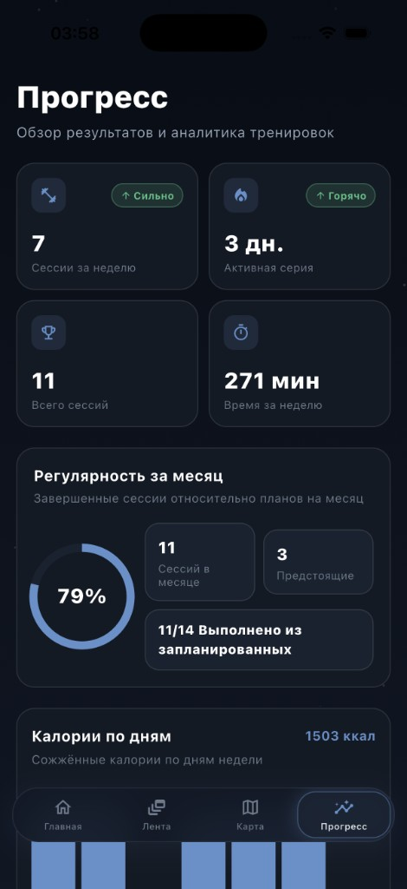
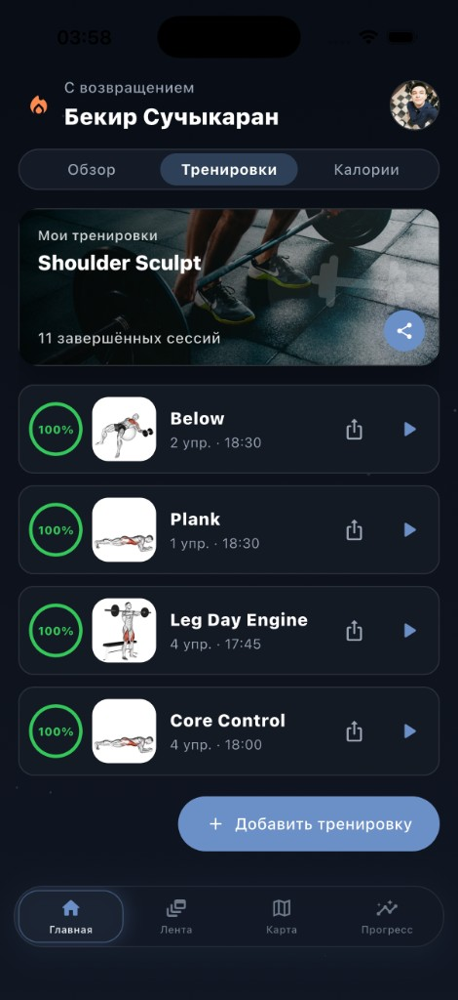
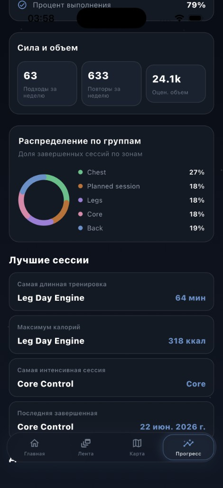

<p align="center">
  
</p>

<h1 align="center">GymCoach</h1>

<p align="center">
  <strong>Personal fitness coach in your pocket.</strong><br/>
  Workout planning, AI nutrition tracking, progress analytics, and a fitness social feed — in one polished dark-mode app.
</p>

<p align="center">
  <a href="https://github.com/bekirs01/gymcoach"></a>
  <a href="https://flutter.dev"></a>
  <a href="https://supabase.com"></a>
  
  
</p>

---

## Overview

**GymCoach** is a Flutter fitness application that brings together everything you need to stay consistent: structured workout plans, live session tracking, detailed progress dashboards, AI-powered meal logging, and a community feed inspired by modern social apps.

Built as a side project with production-grade UI patterns — premium dark theme, card-based layouts, completion rings, bar charts, and muscle-group analytics.

> Screenshots show demo-seeded data for presentation purposes. See [`lib/core/progress_demo_seed.dart`](lib/core/progress_demo_seed.dart).

---

## Screenshots

<table>
  <tr>
    <td align="center" width="50%">
      <br/>
      <sub><b>Progress</b> — weekly metrics, streak, monthly consistency ring</sub>
    </td>
    <td align="center" width="50%">
      <br/>
      <sub><b>Home</b> — personalized greeting, calendar, featured workout</sub>
    </td>
  </tr>
  <tr>
    <td align="center" width="50%">
      <br/>
      <sub><b>Workouts</b> — session list, completion rings, quick start</sub>
    </td>
    <td align="center" width="50%">
      <br/>
      <sub><b>Nutrition AI</b> — natural language meal logging & daily goals</sub>
    </td>
  </tr>
  <tr>
    <td align="center" width="50%">
      <br/>
      <sub><b>Analytics</b> — daily calories, sessions, key session metrics</sub>
    </td>
    <td align="center" width="50%">
      <br/>
      <sub><b>Strength</b> — sets/reps/volume, muscle split, personal records</sub>
    </td>
  </tr>
  <tr>
    <td align="center" colspan="2">
      <br/>
      <sub><b>Social Feed</b> — stories, likes, comments, workout sharing</sub>
    </td>
  </tr>
</table>

---

## Features

| Module | Description |
|--------|-------------|
| **Home** | Daily overview with tabs for Overview, Workouts, and Calories. Calendar widget, articles, and featured workout cards. |
| **Workout Plans** | Create, edit, and run structured sessions. Completion rings, exercise counts, duration, and share actions. |
| **Progress** | Weekly sessions, active streak, total sessions, weekly time. Monthly consistency ring and daily calorie charts. |
| **Analytics** | Bar charts for calories and sessions by day. Average duration, calories, and most-trained muscle group. |
| **Strength & Volume** | Weekly sets, reps, estimated volume. Donut chart for muscle-group distribution and personal bests. |
| **Nutrition AI** | Log meals in natural language (*"2 eggs, 200g chicken, 150g rice"*). Daily calorie target and macro tracking via Supabase Edge Function. |
| **Social Feed** | Story bar, likes, comments, and workout posts — a fitness-focused mini social network. |
| **Territory Map** | GPS-based territory capture on MapLibre *(in development)*. |
| **Pose Detection** | Camera-based rep counting for squat, plank, deadlift, and more via Google ML Kit *(physical device required)*. |
| **Localization** | English and Russian (EN / RU). |

---

## Tech Stack

| Layer | Technology |
|-------|------------|
| **Client** | Flutter 3.x, Material 3, dark theme |
| **Backend** | Supabase — PostgreSQL, PostGIS, Edge Functions |
| **Nutrition AI** | `estimate-nutrition` Edge Function + OpenAI |
| **Maps** | MapLibre GL, Geolocator |
| **Computer Vision** | Google ML Kit Pose Detection |
| **State & Config** | `shared_preferences`, `flutter_dotenv` |
| **Auth** | Supabase anonymous / guest sessions |

---

## Getting Started

### Prerequisites

- [Flutter SDK](https://docs.flutter.dev/get-started/install) (Dart ^3.11)
- Xcode (iOS) and/or Android Studio (Android)
- CocoaPods for iOS: `sudo gem install cocoapods`
- A [Supabase](https://supabase.com) project (for remote persistence, nutrition AI, and territory features)

### Installation

```bash
git clone https://github.com/bekirs01/gymcoach.git
cd gymcoach
flutter pub get
```

### Environment Variables

Create a `.env` file in the project root (copy from `.env.example`):

```env
SUPABASE_URL=https://your-project.supabase.co
SUPABASE_ANON_KEY=your-anon-key

# Optional: Mapbox tokens for Territory Map
MAPBOX_ACCESS_TOKEN=
MAPBOX_DOWNLOADS_TOKEN=

# true = local mock API only, false = real Supabase RPC
TERRITORY_USE_MOCK=false

# Nutrition AI (Edge Function secret — set via Supabase CLI, not in client .env)
# OPENAI_API_KEY=sk-...
```

> `.env` is git-ignored. The app loads `.env` first, then falls back to `.env.example`.

### Supabase Setup

SQL migrations and Edge Functions live under `supabase/`:

```bash
# Deploy nutrition Edge Function (requires Supabase CLI + linked project)
bash scripts/deploy_nutrition_backend.sh
```

Key paths:

- `supabase/migrations/` — database schema (nutrition tracking, workout images, etc.)
- `supabase/functions/estimate-nutrition/` — AI meal estimation
- `supabase/setup.sql` — base setup

### Run

```bash
flutter devices
flutter run
```

### Install on a Physical iPhone (Release)

```bash
flutter run --release -d <device-id>
```

On first launch, trust the developer certificate under **Settings → General → VPN & Device Management**.

> ML Kit pose detection requires a physical device. A Podfile workaround is applied for the iOS Simulator.

---

## Project Structure

```
lib/
├── app/                    # Theme, root widget, app state
├── core/                   # Supabase config, stats, demo seed
├── data/                   # Local & remote persistence
├── features/
│   ├── home/               # Home dashboard & tabs
│   ├── plans/              # Workout plans
│   ├── workout/            # Live session tracking
│   ├── nutrition/          # Nutrition AI tab
│   ├── progress/           # Progress & analytics
│   ├── feed/               # Social feed
│   ├── territory_map/      # GPS territory map
│   ├── camera_validation/  # Pose detection
│   └── profile/            # Profile & settings
└── l10n/                   # EN / RU localization

docs/screenshots/           # README screenshots
marketing/reddit/           # Reddit showcase kit
supabase/                   # Migrations, Edge Functions, seed
```

---

## Development

```bash
# Regenerate localization files
flutter gen-l10n

# Static analysis
flutter analyze

# Tests
flutter test
```

---

## Marketing

A ready-to-use Reddit showcase kit with post copy (TR / EN) lives in [`marketing/reddit/`](marketing/reddit/README.md).

---

## License

Private project — not published to pub.dev (`publish_to: none`).

---

<p align="center">
  <sub>Built with Flutter · Side project / student portfolio</sub>
</p>
