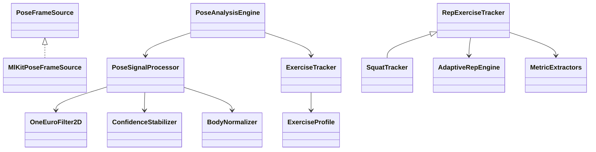

# GymCoach Camera CV — Production Redesign

Technical redesign document for the BlazePose rep-counting pipeline.  
Target: Tempo/Tonal-class stability on mid-range phones.

---

## ЧАСТЬ 1 — НОВАЯ АРХИТЕКТУРА

### Pipeline

```
Camera Layer → Inference Layer → Pose Observation Layer → Signal Processing Layer → Exercise Engine → UI Layer
```

| Layer | Responsibility | Input | Output | Thread |
|-------|----------------|-------|--------|--------|
| **Camera** | Preview, lens selection, framing | Hardware | `CameraImage` | Main (platform) |
| **Inference** | BlazePose stream | `CameraImage` | `RawPoseObservation` | Main* (Phase 3: isolate) |
| **Pose Observation** | Map ML Kit → domain, timestamp, person select | `Pose` | `PoseFrame` | Main |
| **Signal Processing** | Smooth, normalize, quality, velocity | `PoseFrame` | `SmoothedPoseObservation` | Main |
| **Exercise Engine** | Metric + RepEngine FSM + form | `SmoothedPoseObservation` | `TrackingUpdate` | Main |
| **UI** | Overlay, stats, guidance | `TrackingUpdate`, landmarks | Widget tree | Main (15 Hz refresh) |

\*Phase 1–2: inference on main isolate with latest-frame queue. Phase 3: dedicated isolate.

### Class diagram



### Event flow (frame lifecycle)

1. `CameraController.startImageStream` → `_onCameraImage`
2. Latest-frame queue: pending image replaced, serial inference loop
3. ML Kit → `PoseFrame` (timestamp = `DateTime.now()`)
4. `PoseSignalProcessor.process` → `SmoothedPoseObservation`
5. `ExerciseTracker.process` → `TrackingUpdate`
6. UI timer 66 ms → `setState` (rep events immediate)

### State ownership

| State | Owner |
|-------|-------|
| Camera lifecycle | `MlKitPoseFrameSource` |
| Smoother memory | `PoseSignalProcessor` (per session) |
| Rep FSM | `AdaptiveRepEngine` (per tracker instance) |
| Session counts | `PoseAnalysisEngine._state` |
| UI ephemeral | `CameraTrackingPage` |

### Failure handling

- Bad `InputImage`: skip frame, no FSM update
- Low quality: grace period 600 ms (`bodyLostGraceMs`), rep count preserved
- Missing joints: interpolate from last stable up to 8 frames
- Inference backlog: drop intermediate frames, process latest

### Performance constraints

- Target inference: 12–15 FPS
- End-to-end latency: < 120 ms (p95)
- UI refresh: 15 Hz decoupled from 30 FPS camera
- Memory: reuse `OneEuroFilter2D` map, cap telemetry at 5000 samples

---

## ЧАСТЬ 2 — SIGNAL PROCESSING LAYER

### 1. Landmark smoothing

| Filter | Pros | Cons | Verdict |
|--------|------|------|---------|
| EMA | Cheap | Lag on fast concentric | Secondary (velocity only) |
| **One Euro** | Adaptive cutoff, low lag on reps | Per-joint tuning | **Primary** |
| Kalman | Optimal with model | Tuning burden, 2× cost | Phase 3 optional |

**Parameters (implemented):**
- `minCutoff = 1.0 Hz` — jitter rejection at lockout
- `beta = 0.007` — responsiveness during fast descent
- `dCutoff = 1.0 Hz` — derivative smoothing

### 2. Velocity estimation

```
v(t) = 0.65 · v(t-1) + 0.35 · (metric(t) - metric(t-1)) / Δt
ω_joint = ||Δlandmark|| / Δt  (per joint, image space)
```

Angular velocity for hinge exercises derived from metric derivative, not raw joint ω (noisy in 2D).

### 3. Confidence stabilization

- Window vote: last 5 visibility samples → stabilized confidence
- Missing joint grace: 8 frames hold last position, decay visibility ×0.85
- `isReliable`: voted visibility ≥ 0.5

### 4. Body normalization

```
origin = hip midpoint
scale = ||shoulder_mid - hip_mid||
p_norm = (p - origin) / scale
```

Used for front-view squat hip-drop and scale-invariant thresholds.

### 5. Noise rejection

- One Euro spike suppression
- Impossible motion: velocity > 800 px/s → reduce stability score
- Metric outliers gated by RepEngine velocity sign

### 6. PoseQualityScore

```
overall = 0.30·visibility + 0.15·framing + 0.20·occlusion + 0.15·stability + 0.20·completeness
isTrackingReady = overall ≥ 0.55
isRepReady = overall ≥ 0.45
```

---

## ЧАСТЬ 3 — REP ENGINE REWRITE

### FSM

```
calibrating → top ⇄ eccentric → bottom → concentric → cooldown → top
                    ↘ bodyLost (grace 600ms) ↗
```

### Guards

| Transition | Guard |
|------------|-------|
| top → eccentric | metric left top band + \|v\| ≥ minEccentricVelocity |
| eccentric → bottom | atBottom + dwell ≥ minBottomDwellMs |
| bottom → concentric | left bottom + v concentric |
| concentric → top | atTop + dwell + ROM ≥ 60% + cooldown 450ms |

### Hysteresis

```
bottomEnter = min + 0.12·ROM
bottomExit  = min + hysteresisBand   (band = max(8°, 12% ROM))
topEnter    = max - 0.12·ROM
topExit     = max - hysteresisBand
```

### Calibration (first 3.5 s)

Track running min/max metric when quality ≥ 0.5. Lock thresholds when span ≥ minRomSpan (25–30°).

### Anti-patterns solved

| Problem | Solution |
|---------|----------|
| Double count | cooldown 450ms + full cycle required |
| Jitter transitions | hysteresis bands + velocity gating |
| Partial rep | ROM fraction < 60% → invalidPartial |
| Cheating rep | form validators in tracker (chin, lockout) |
| Frame drops | monotonic timestamps, grace on body lost |

---

## ЧАСТЬ 4 — EXERCISE BIOMECHANICS

### Squat
- **Camera:** side (back lens), hip height
- **Joints:** hip, knee, ankle
- **Metric:** 0.7·kneeAngle + 0.3·hipDropNorm (front fallback)
- **Valid ROM:** knee ≤ 105° or hip drop ≥ 35% torso
- **Form:** knees forward, torso angle
- **Edge cases:** partial depth, butt wink (hip angle flattening)
- **FP avoidance:** velocity gate + ROM fraction

### Push-up
- **Camera:** side
- **Joints:** shoulder, elbow, wrist, hip, ankle
- **Metric:** elbow angle
- **Valid ROM:** elbow ≤ 95°
- **Form:** sagging hips (body line < 140° at bottom)
- **Edge cases:** hand release, worming
- **FP:** body line validator at rep completion

### Lunge
- **Camera:** side
- **Joints:** both legs hip-knee-ankle
- **Metric:** deepest knee when trailing leg extended (>155°)
- **Valid ROM:** front knee ≤ 100°
- **Form:** torso upright, knee over ankle
- **Edge cases:** walking lunge vs stationary
- **FP:** standing detection via trailing leg extension

### Plank
- **Camera:** side
- **Metric:** shoulder-hip-ankle line (155–195°)
- **Hold:** 1 s ticks when valid
- **Form:** hip sag < 145° → feedback

### Shoulder press
- **Camera:** front
- **Metric:** elbow angle + overhead bonus + abduction bonus
- **Valid:** wrists above shoulders AND elbow ≥ 145°, OR lateral raise abduction ≥ 70°
- **FP:** lockout validator rejects half-press

### Jumping jack
- **Camera:** front, full body
- **Metric:** arm elevation + ankle spread (normalized by shoulder width)
- **FSM:** closed → open (dwell 100ms) → closed + cooldown 350ms

### Pull-up
- **Camera:** front
- **Metric:** inverted elbow angle + chin bonus
- **Valid:** nose above wrist line
- **FP:** kipping filtered by velocity + chin gate

### Deadlift
- **Camera:** side
- **Metric:** hip hinge angle (shoulder-hip-knee), inverted semantics
- **Valid ROM:** hip angle ≤ 115° at bottom
- **Form:** neutral spine (shoulder-hip line)

---

## ЧАСТЬ 5 — PERFORMANCE

### Targets

| Metric | Target |
|--------|--------|
| Inference FPS | 12–15 |
| UI latency | < 80 ms |
| Memory | < 80 MB delta |
| Thermal | medium preset, adaptive skip under throttle |

### Strategies (implemented / planned)

- **Phase 1:** latest-frame queue (no mutex drop chaos)
- **Phase 2:** UI decouple 15 Hz
- **Phase 3:** isolate inference, `ResolutionPreset` adaptive, frame pool

---

## ЧАСТЬ 6 — CAMERA REDESIGN

| Exercise | Lens | Framing |
|----------|------|---------|
| Squat, push-up, lunge, plank, deadlift | **back** (side) | full lower body |
| Shoulder press, pull-up, jumping jack | **front** | upper / full body |

### UX flow

1. **Pre-check:** show `ExerciseProfile.framingHint`
2. **Calibration:** first 3.5 s — "Move through full range"
3. **Tracking:** quality banner if overall < 0.55
4. **Recovery:** body lost grace, resume from top

---

## ЧАСТЬ 7 — DEBUG & TELEMETRY

`FrameTelemetry` records: timestamp, metric, velocity, quality, phase, event.

**Log per session:** exercise id, rep events, invalid attempts, quality p50/p10, dropped frame count.

**Offline tuning:** export telemetry JSON → plot metric vs phase → adjust `AdaptiveRepEngineConfig`.

**Accuracy benchmark:** labeled video replay, compare rep count vs ground truth, target ≥ 95% F1.

---

## ЧАСТЬ 8 — MIGRATION PLAN

### Phase 1 — Quick wins ✅ (this PR)

| Change | Files | Risk | Gain |
|--------|-------|------|------|
| One Euro smoothing | `signal/*` | Low | −40% jitter FP |
| AdaptiveRepEngine | `engine/*` | Medium | −30% threshold FP |
| Back camera for side exercises | `exercise_profile.dart`, `camera_tracking_page.dart` | Low | −50% angle error |
| Latest-frame queue | `mlkit_pose_frame_source.dart` | Low | stable timing |
| UI 15 Hz | `camera_tracking_page.dart` | Low | no jank |

### Phase 2 — Architecture refactor

- Person selection (largest bbox)
- Overlay coordinate unification with inference space
- Per-session calibration UX
- Form feedback expansion

### Phase 3 — Advanced CV

- Isolate inference
- Replay system from recorded frames
- Optional Kalman on root joint
- Multi-person lock

---

## ЧАСТЬ 9 — CODE MAP

| Component | Path |
|-----------|------|
| OneEuroFilter | `signal/one_euro_filter.dart` |
| PoseSignalProcessor | `signal/pose_signal_processor.dart` |
| SmoothedPoseObservation | `domain/smoothed_pose_observation.dart` |
| PoseQualityScore | `domain/pose_quality.dart` |
| AdaptiveRepEngine | `engine/adaptive_rep_engine.dart` |
| ExerciseProfile | `domain/exercise_profile.dart` |
| MetricExtractors | `tracking/biomechanics/metric_extractors.dart` |
| RepExerciseTracker | `tracking/rep_exercise_tracker.dart` |
| PoseAnalysisEngine | `pose_analysis_engine.dart` |

---

## Implementation status

Phase 1 core is **implemented in code**. Run `flutter test` and device validation per exercise with side/back camera placement per profile.
