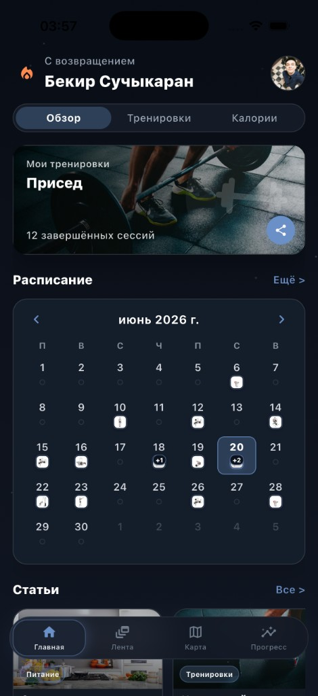
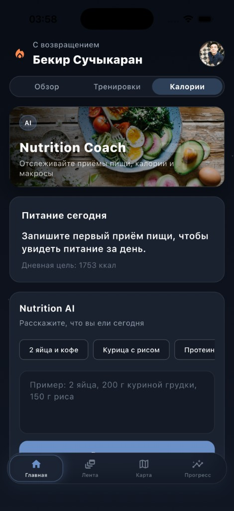
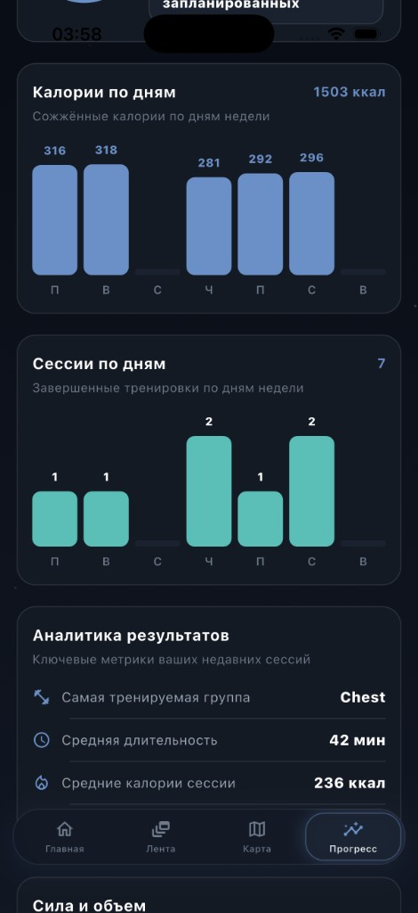
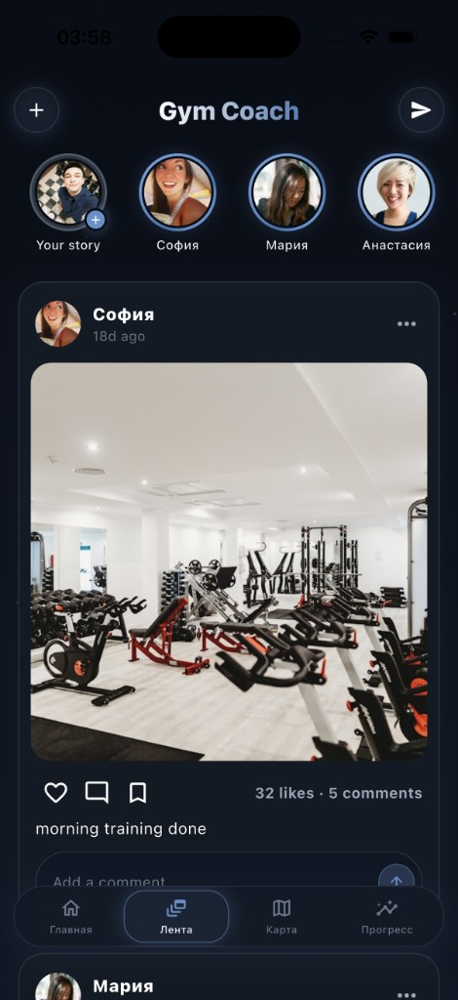

# GymCoach — Reddit Marketing Kit

> **Side project · Flutter · Supabase** — Antrenman planlama, AI beslenme, ilerleme analitiği ve sosyal feed tek uygulamada.

[](https://github.com/bekirs01/gymcoach)
[](https://flutter.dev)
[](https://supabase.com)

---

## Özet

**GymCoach**, kişisel antrenman planlamasından seans takibine, detaylı ilerleme analitiğinden AI destekli beslenme kaydına ve fitness odaklı sosyal feed'e kadar tüm akışı tek, karanlık temalı bir arayüzde birleştirir.

| Metrik | Değer |
|--------|-------|
| Haftalık seans | 7 |
| Aktif streak | 3 gün |
| Aylık plan tamamlama | %79 |
| Haftalık süre | 271 dk |
| Günlük kalori hedefi | ~1753 kcal |

> Ekran görüntülerindeki veriler demo seed ile doldurulmuştur — gerçek kullanıcı verisi değildir.

---

## Ekran Görüntüleri

Reddit galeri yüklemesi için **numaralı sırayı koruyun**. Kapak görseli: `01_progress_overview.png`.

### 1 · İlerleme Özeti

Haftalık seans, streak, toplam seans ve haftalık süre. Aylık düzenlilik halkası (%79) ve günlük kalori grafiği.


---

### 2 · Ana Ekran

Kişiselleştirilmiş karşılama, takvim widget'ı, planlanan seanslar ve öne çıkan antrenman kartı.



---

### 3 · Antrenmanlar

Seans listesi, %100 tamamlama halkaları, egzersiz sayısı ve süre. Paylaşım ve hızlı başlatma.


---

### 4 · Nutrition AI

Doğal dilde yemek girişi, hızlı chip'ler ve günlük kalori hedefi. Supabase Edge Function + OpenAI.



---

### 5 · Analitik Grafikler

Günlük kalori ve seans bar chart'ları. Ortalama süre, kalori ve en çok çalışılan kas grubu.



---

### 6 · Güç & Hacim

Haftalık set/tekrar/hacim metrikleri, kas grubu dağılımı (donut chart) ve kişisel rekorlar.


---

### 7 · Sosyal Feed

Story bar, beğeni/yorum, antrenman paylaşımı — fitness odaklı mini sosyal ağ.



---

## Özellikler

| Modül | Ne sunuyor |
|-------|------------|
| **Ana ekran** | Günlük özet, takvim, öne çıkan antrenman kartları |
| **Antrenmanlar** | Plan oluşturma, seans başlatma, tamamlama halkaları, paylaşım |
| **İlerleme** | Streak, aylık düzenlilik, günlük grafikler, kas grubu dağılımı |
| **Nutrition AI** | "2 yumurta, 200g tavuk…" — doğal dilde makro tahmini |
| **Sosyal feed** | Story, beğeni, yorum, antrenman paylaşımı |
| **Territory Map** | GPS tabanlı bölge yakalama *(geliştirme aşamasında)* |
| **Pose detection** | Kamera ile tekrar sayımı — squat, plank, deadlift *(ML Kit)* |

### Teknik stack

| Katman | Teknoloji |
|--------|-----------|
| UI | Flutter 3.x, Material 3, dark theme |
| Backend | Supabase (PostgreSQL + Edge Functions + PostGIS) |
| Beslenme AI | `estimate-nutrition` Edge Function, OpenAI |
| Harita | MapLibre GL, Geolocator |
| Pose | Google ML Kit |
| Lokalizasyon | EN / RU |

---

## Reddit Paylaşım Rehberi

### Önerilen subreddit'ler

| Subreddit | Post tipi | Not |
|-----------|-----------|-----|
| [r/FlutterDev](https://reddit.com/r/FlutterDev) | Gallery + teknik detay | Flutter geliştiricileri |
| [r/SideProject](https://reddit.com/r/SideProject) | Gallery + hikâye | Bağımsız proje vitrini |
| [r/fitness](https://reddit.com/r/fitness) | Gallery, kısa metin | Ürün odaklı |
| [r/bodyweightfitness](https://reddit.com/r/bodyweightfitness) | Gallery | Antrenman takibi vurgusu |
| [r/Turkey](https://reddit.com/r/Turkey) | Metin + 1–2 görsel | Türkçe topluluk |

**Flair:** `Showcase` · `Project` · `App` (subreddit'e göre)

**En iyi saat:** Salı–Perşembe, 18:00–22:00 (TR saati)

---

### Görsel yükleme sırası

Reddit → **Images & Video → Post** → galeri modu:

```
01_progress_overview.png   ← Kapak (thumbnail)
02_home_overview.png
03_workouts.png
04_nutrition_ai.png
05_analytics_charts.png
06_strength_volume.png
07_social_feed.png
```

| # | Reddit alt başlığı (opsiyonel) |
|---|-------------------------------|
| 1 | Progress — weekly overview & monthly consistency |
| 2 | Home — calendar & featured workout |
| 3 | Workouts — session list & completion rings |
| 4 | Nutrition AI — natural language meal logging |
| 5 | Analytics — daily calorie & session charts |
| 6 | Strength — sets/reps/volume & muscle split |
| 7 | Social — fitness community feed |

---

## Hazır Post Metinleri

Detaylı kopyala-yapıştır metinleri:

- 🇹🇷 Türkçe → [`POST_TR.md`](POST_TR.md)
- 🇬🇧 English → [`POST_EN.md`](POST_EN.md)

### Başlık önerileri

**A — r/FlutterDev / r/SideProject (önerilen):**
> GymCoach — Flutter ile kişisel antrenör uygulaması: planlama, AI beslenme, ilerleme analitiği ve sosyal feed

**B — r/fitness (kısa):**
> Antrenmanlarımı planlayan, takip eden ve analiz eden kendi fitness uygulamamı geliştirdim

**C — merak uyandıran:**
> 7 antrenman/hafta, %79 plan tamamlama — hepsini tek bir Flutter uygulamasında topladım

**EN — r/FlutterDev:**
> GymCoach — Flutter fitness app: workout planning, AI nutrition tracking, progress analytics & social feed

---

### İlk yorum (post attıktan hemen sonra)

> **Tech stack:** Flutter client + Supabase Edge Functions. Beslenme tahmini `estimate-nutrition` edge function üzerinden çalışıyor. Progress ekranındaki demo veriler `progress_demo_seed` ile dolduruluyor — gerçek seans verisiyle aynı pipeline. Sorularınızı yanıtlamaya hazırım.

---

## Paylaşım Öncesi Kontrol Listesi

- [ ] `.env` ve API anahtarları repoda **yok**
- [ ] Demo veriler gerçek kullanıcı verisi değil (açıkça belirtildi)
- [ ] GitHub repo linki güncel: [github.com/bekirs01/gymcoach](https://github.com/bekirs01/gymcoach)
- [ ] 7 görsel numaralı sırayla yüklendi
- [ ] İlk 30 dk içinde yorumlara cevap ver
- [ ] Hedef subreddit'in self-promotion kuralları okundu

---

## Dosya Yapısı

```
marketing/reddit/
├── README.md              ← Bu dosya (ana rehber)
├── POST_TR.md             ← Türkçe post metni
├── POST_EN.md             ← English post body
└── screenshots/
    ├── 01_progress_overview.png
    ├── 02_home_overview.png
    ├── 03_workouts.png
    ├── 04_nutrition_ai.png
    ├── 05_analytics_charts.png
    ├── 06_strength_volume.png
    └── 07_social_feed.png
```

---

*GymCoach — side project / öğrenci projesi. Henüz App Store'da değil. Geri bildirim için paylaşılıyor.*
